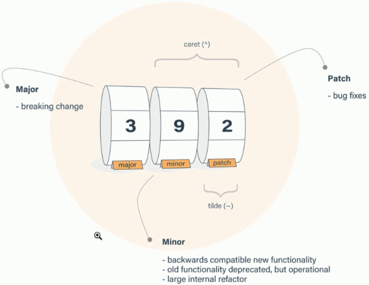

# NPM

* Es un gestor de paquetes el mas popular de JavaScript.
* npmjs.com
* Node Package Manager

## Instalación

* LTS: Soporte mayor a las features que estan en  la versión. Es para producción.

* Ver la version instalada

  ```shell
  npm -v
  ```

  

* Actualizar a una versión más actual

  ```shell
  npm install -g npm@latest
  ```

## Iniciar un proyecto

* Crear la carpeta

* Inicializarla como un proyecto git

  ```shell
  git init
  ```

* Inicializar el proyecto

  ```shell
  npm init
  ```

  Sin solocitar datos

  ```shell
  npm init -y
  ```

  Establecer valores estandar para nuestros proyectos. Se añade a la configuración de npm.

  ```shell
  npm set init.author.email "byron7cueva@gmail.com"
  npm set init.author.name "Byron Cueva"
  npm set init.license "MIT"
  npm init -y
  ```

## Instalar paquetes

* A partir de la versión 5 de npm por defecto se instala como dependencia requerida para el proyecto.

  ```shell
  npm install moment
  npm install moment --save
  npm i moment -S
  ```

* Dependencias de desarrollo

  ```shell
  npm install moment --save-dev
  npm i date-fns -D
  ```

* Dependencias que necesitamos que corran de forma global

  ```shell
  npm install -g nodemon
  ```

* Listar paquetes instalados de forma global. (--depth 0 profundidad en este caso todos)

  ```shell
  npm list -g --depth 0
  ```

* Instalar de forma opcional un paquete.

  ```shell
  npm install eslint -O
  ```

* Ver paquetes que necesitan financiamiento

  ```shell
  npm fund
  ```

* Indicar dependencias que no van a ser instaladas en el proyecto pero nos interesa ver el output y simular la instalación.

  ```shell
  npm install react --dry-run
  ```

* Forzar una instalación que sea desde el ultimo recurso (ultima versión) desde el servidor npm.

  ```shell
  npm install webpack -f
  ```

* Instalación completa leendo la configuración del package.json

  ```shell
  npm install
  ```

* Instalación indicando una versión particular

  ```shell
  npm install json-server@0.15.0
  ```

## Actualizar dependencias

* Listar los paquetes que tiene el proyecto. Imprime todas dependencias en forma de àrbol indicando la gerarquia de dependencias.

  ```shell
  npm list
  ```

* Ver paquetes que se encuentran desactualizados. Con el flag --dd se puede ver un log de lo que esta haciendo npm, se lo puede utilizar en cualquier comando.

  ```shell
  npm outdate
  npm outdate --dd
  ```

* Actualizar todos los paquetes.

  ```shell
  npm update
  ```

* Update de un paquete de forma particular.

  ```shell
  npm install json-server@latest
  ```

## Desinstalar paquetes

* Desinstalar un único paquete.

  ```shell
  npm uninstall json-server
  ```

* Desinstalar sin eliminarlo del package.json.

  ```shell
  npm uninstall webpack --no-save
  ```

## Versionado semántico



* major: Cambio mayor.
* minor: Cambios menores, cambios que añaden ciertas funcionalidades pero que no son un gran paso para decir que son cambio de una versión nueva.
* patch: Parches o bug fixes.
* ^. Garantizamos que cuando tengamos una actualización solo se va recibir cambios menores y de patch.
* ~. Garantizamos que solo vamos aceptar cambios solamente los cambios que son patch o bug fix.
* Desde la version 5  de npm se cuenta con el archivo package-lock.json. Contiene configuraciones de dependencias. Garantiza que las versiones que estamos instalando sean las que necesitamos.

## Ejecutar tareas

* La sección *scripts* dentro del package.json, son comandos que nos permite establecer para poderlos ejecutar desde la consola, estas nos van a generar algunas salidas.

* .exit. Para salir del REPL. cli de nodejs.

* Correr tareas a traves de los alias por decto. npm start, ejecuta el script start o node sobre el archivo indicado en main en el package.json.

  ```shell
  npm test
  npm start
  ```

## Solucionar problemas

* Ejecutar una tarea en modo verbose.

  ```shell
  npm run nombre_tarea --dd
  ```

* Eliminar el cache. Para que npm vaya nuevamente a los servidores de npm.

  ```shell
  npm cache clean --force
  ```

* Verificar la cache

  ```shell
  npm cache verify
  ```

* Paquetes corruptos o que esten incompletos. En ese caso se debe eliminar toda la carpeta de node_modules y luego ejecutar  ``npm install`` 

* Paquete para eliminar carpetas que funciona en todos los sistemas operativos. "rimraf", se debe instalar de forma global con npm.

  ```shell
  rimraf node_modules
  ```

## Seguridad

* Analizar que paquetes se esta instalando y si alguno deberia estar actualizado. Auditar el proyecto.

  ```shell
  npm audit
  ```

* Generar un documento json, donde esta la información, mas detallada de lo que esta pasando

  ```shell
  npm audit --json
  ```

*  Dar seguimiento a una dependencia critica. Actulalizar el paquete pero tambièn las dependencias que este necesita.

  ```shell
  npm update nombre_paquete --depth 2
  ```

* Reparar errores de bulnerabilidades del proyecto. Actualiza todos los paquetes que tienen problemas a las ultimas versiones, con las actualizaciones de las dependencias que estos requieren.

  ```shell
  npm audit fix
  ```

* snyk: Es una herramienta se enfoca en estar al dìa con las dependencias del proyecto.

## Crear un paquete para NPM

* Probar el paquete de forma local, instalandolo de de forma global. Dentro de la carpeta del paquete a probar ejecutar.

  ```shell
  npm link
  ```

* Instalandolo localmente de forma global

  ```shell
  sudo npm install -g /ruta/al/paquete
  ```

* Logearse desde el terminal para publicar paquetes en npm

  ```shell
  npm adduser
  ```

* Publicar el paquete

  ```shell
  npm publish
  ```

* Se puede actualizar los datos del respositorio con `npm init`

* Actualizar la versión

  ```shell
  npm version patch
  npm version minor
  npm version major
  ```
  
  
  
* Requisitos para que nuestro paquese sea considerado un buen paquete.

  * Debe contener un REAME.md bien explicado, este debe estar en ingles. Motrar que comandos tiene, como usarlo, invitar a su contribución.
  * Conectarlo a un repositorio.
  * 

